<h1 align="center">Proyecto Challenge</h1>

## Descripción:  
#### Es el desarrollo de una aplicación *responsive* que se puede usar: en máquinas de escritorio; tablet y celulares. 

## Herramientas utilizadas  :hammer_and_wrench:

## Uso:
#### Es una aplicación, que nos permite ingresar por pantalla un texto y encriptarlo en otra ventana, en la cual se puede desencriptar. Además una vez realizada la acción, se puede redireccionar a la página principal.

### Escritorio :desktop_computer: 

#### Página principal (index.html)
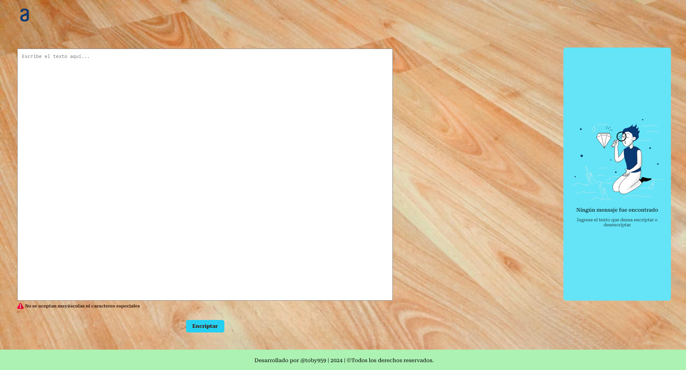
___
#### Mensaje por pantalla en caso de haber insertado texto que no corresponde: (informando no se aceptan mayúsculas; caracteres especiales ni acentos), luego de presionar 'Aceptar', también se limpia la pantalla. 

___
#### Mensaje por pantalla, indicando el paso a seguir. 
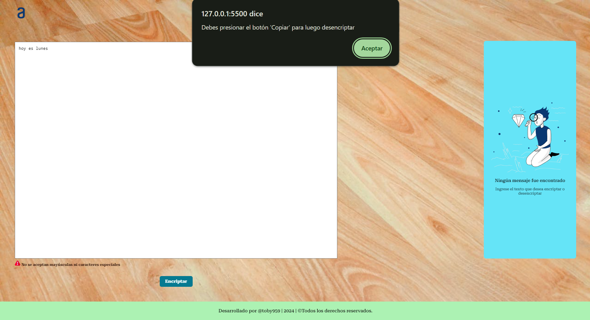
___
#### Pantalla secundaria (about.html) se habilita solo el botón 'Copiar'  
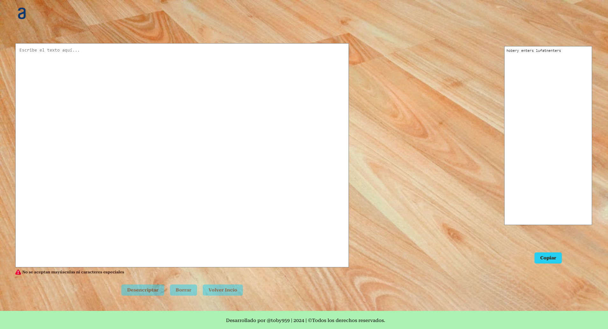
___
#### Al darle click al botón 'Copiar' nos da la siguiente pauta a seguir. Despúes limpia la pantalla.
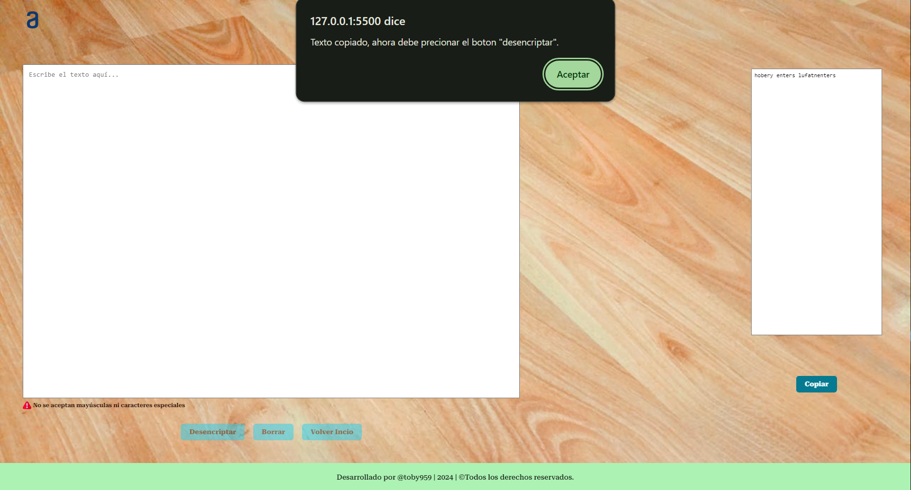
___
#### Solo se habilita el bóton 'Desencriptar' el cúal se puede usar en una sola ocasión. Luego se habilitan los botones 'Borrar' y 'Volver Inicio'. Quedando el botón 'Copiar' anulado, despúes de haber copiado el texto.
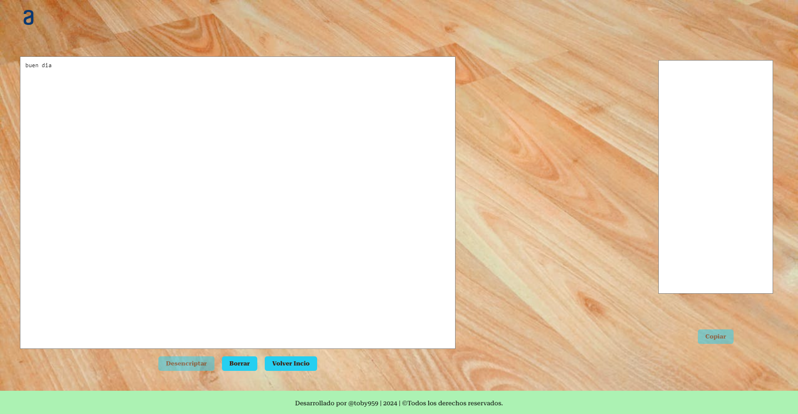
___
#### Se puede usar solo una vez el bóton 'Borrar', despúes se puede usar el bóton 'Volver Inicio'.

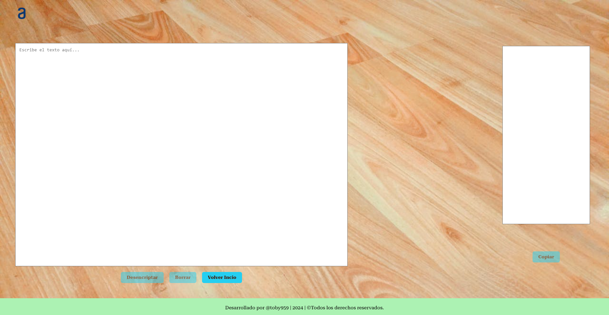
___

### Tablet :iphone:

#### Página principal (index.html)
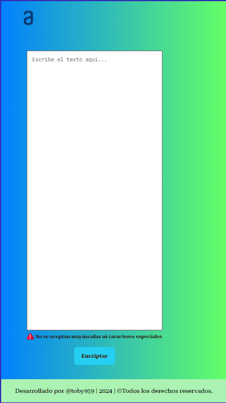
___
#### Página secundaria (about.html)
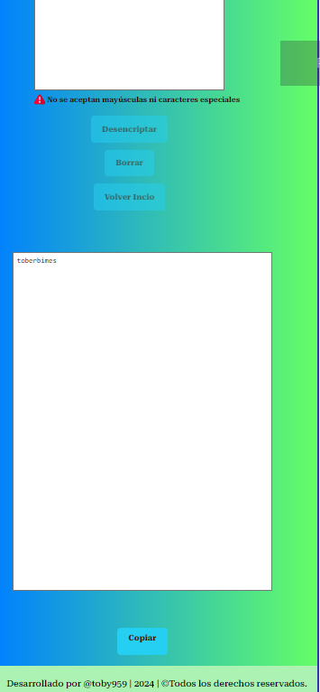
___
#### Se observa que luego de presionar 'Desencriptar' se habilitan los botones 'Borrar' y 'Volver Inicio' 
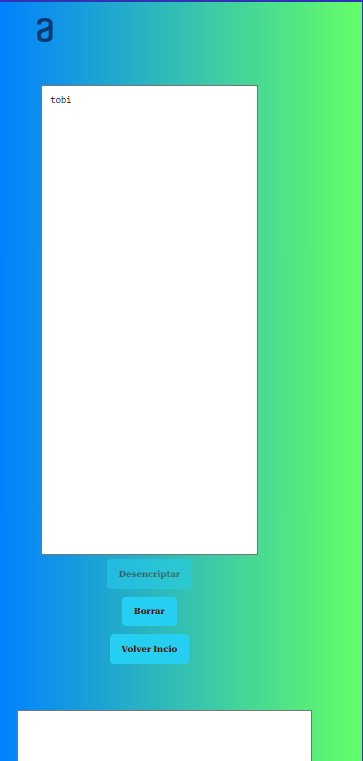
___

### Celular :phone:
#### Página principal (index.html)
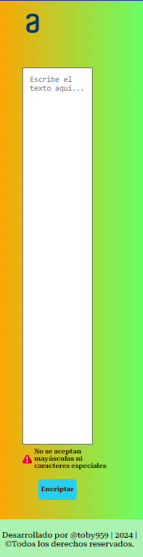
___
#### Página secundaria (about.html)
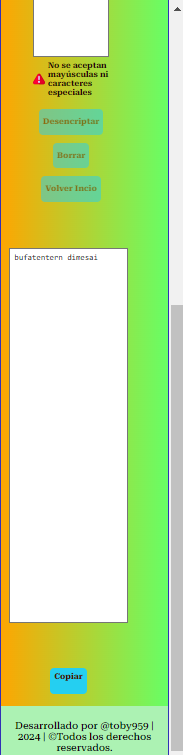
___
#### Se observa que luego de presionar 'Desencriptar' se habilitan los botones 'Borrar' y 'Volver Inicio' 
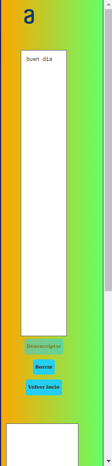
___

### Referencia al Proyecto: https://github.com/toby959/challenge

### Extras:
#### Se desencripto el reto solicitado.

#### Se le agregó a la URL de 'Challenge' una imagen thumbnail 'incognita'.
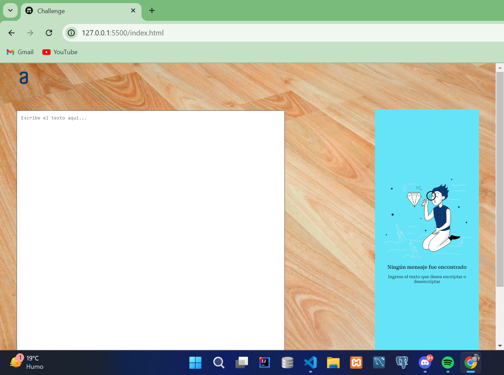

#### GitHub Pages: https://toby959.github.io/challenge/

#### Codigó QR de la página: 
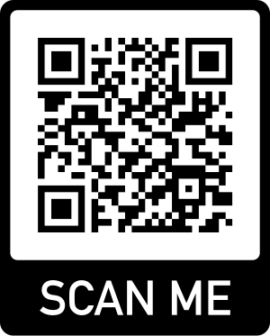
